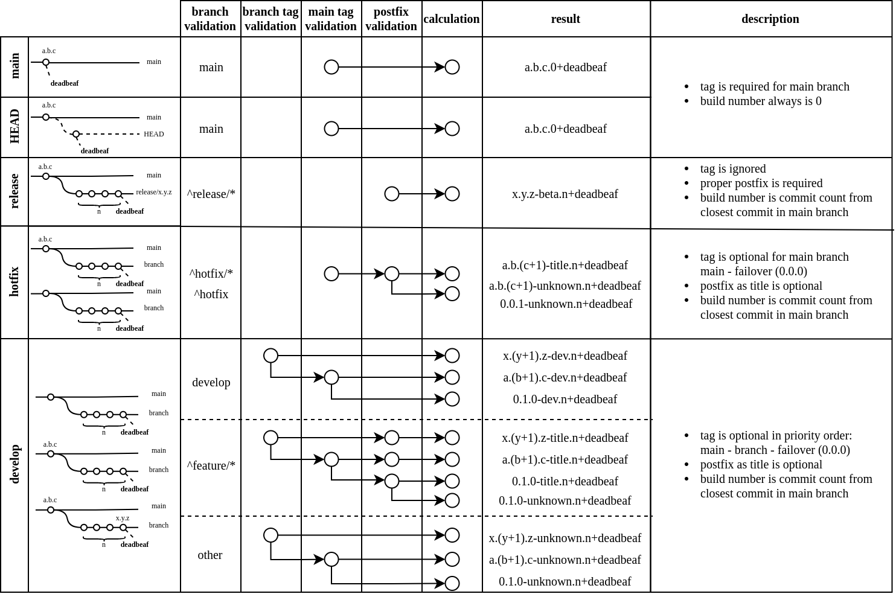

# Purpose

This is custom docker image with bash based script that provides semantic version generation with specific logic (different than gitversion).
A unique release name is guaranteed for every branch+changeset combination.

Semantic version based on tag. Tag choose priority according branch type

- main branch releases can be versioned only from current commit tag
- detached HEAD should have tag that belongs main branch
- release/* releases can be versioned only from branch name but not tag, like release/1.1.1
- hotfix releases based on main tag (or failover) and postfix as title for semver
- all others in priority: branch tag -> main tag -> failover.
That grants us option when we can build well versioned feature/* releases with any tag inside. 

Image below is editable via draw.io



# Kubernetes use (tekton pipeline)

That image can be used in tekton pipelines to display currently deployed app version for TM/PM/Dev/Client

```yaml
buildTaskSteps:
  - name: git-version
    image: "docker.io/saritasallc/git-version"
    imagePullPolicy: IfNotPresent
    resources: {}
    workingDir: $(resources.inputs.app.path)
    script: |
      #!/bin/bash
      BRANCH=$(params.branch)
      if [[ $BRANCH =~ ^refs/heads/(main|release/[0-9.]+)$ ]];
      then
          local_tags=$(git tag --points-at HEAD)
          echo "remove local head tags"
          echo "$local_tags"
          git tag -d "$local_tags"
      fi
      pure_branch=$(echo "$BRANCH" | sed 's/refs\/heads\///')
      echo "PURE BRANCH:" "$pure_branch"
      # make sure we're not in detached head status
      git fetch
      git symbolic-ref -q HEAD || git checkout "$pure_branch"
      git branch
      semver > $(params.source_subpath)/web/version.html || echo "version file creation skipped"

```

See more in [tekton-pipelines]( https://github.com/saritasa-nest/saritasa-devops-helm-charts/blob/5c3adcca456dc25f3812164041bdf5d32f678137/charts/tekton-pipelines/values.yaml#L105 ).