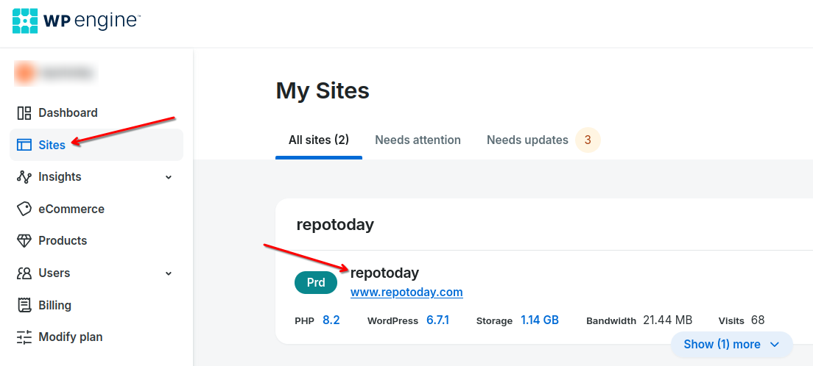
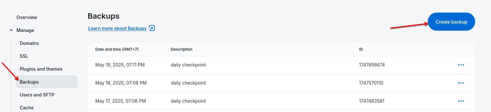
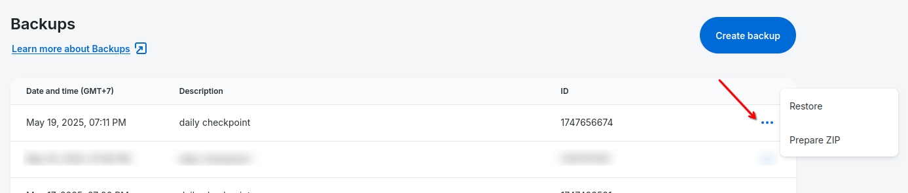

# WPEngine reusable workflow

## `deploy.yaml`

This reusable workflow is used for deploying code from the GitHub repository to the WordPress server via WPEngine.
Workflow creates a backup of the environment, deploys code, and sends a notification to the Slack channel about the result of the deploy.

### Inputs

| Name              | Description                                                                         | Required | Default        |
| ----------------- | ----------------------------------------------------------------------------------- | -------- | -------------- |
| `backup_emails`   | Notification emails list to send confirmation about the backup, separated by commas | Yes      | -              |
| `backup_interval` | Interval for backup status check (in seconds)                                       | No       | 30             |
| `backup_timeout`  | Wait time for backup to complete (in minutes)                                       | No       | 5              |
| `exclude_flags`   | Additional rsync exclude flags (can be multiple)                                    | No       | `--exclude=.*` |
| `jira_key`        | JIRA key of the project                                                             | Yes      | -              |
| `wp_engine_env`   | Name of the WPEngine environment, i.e. projectnamedev                               | Yes      | -              |

### Secrets

| Name                    | Description                                        | Required |
| ----------------------- | -------------------------------------------------- | -------- |
| `slack_webhook_url`     | Slack webhook url to send notifications to channel | Yes      |
| `wpengine_api_username` | Username for API access to WPEngine                | Yes      |
| `wpengine_api_password` | Password for API access to WPEngine                | Yes      |
| `wpengine_ssh_key`      | Private SSH key needed to connect to server        | Yes      |

## `backup` job

This job creates a full backup of the selected environment via calls to the WPEngine API

### How to access backups

Backups are managed and stored by WPEngine. They are available in the WPEngine User Portal.

1. Go to the [Sites](https://my.wpengine.com/sites) page
   
2. Select environment (e.g., `repotoday`)
3. Go to **Backups** section
4. Find the needed backup (by date, description or ID)
5. Prepare ZIP for download or restore backup

### How to create backup (clickops way)

`backup` job uses API calls to create backups, but if needed one can create a backup manually

1. In **Backups** select **Create backup**
   
2. Select backup destination and notification emails
3. Confirm the create
4. To see details about backup creation, click **View details** on a status banner

WPEngine's backup process creates a complete snapshot of the environment, including:

- database
- files
- plugins and their configurations

### How to restore backup

1. In **Backups** select the backup you want to restore
   
2. Click **Restore**
3. Select an environment name to restore this backup to
4. Confirm the restore

**Note: This will overwrite all content of the selected environment to match the content of the selected backup**

For more info on backups, see [official documentation on Backup and Restore](https://wpengine.com/support/restore)

## `deploy` job

This job uses official WPEngine action to deploy code from GitHub to the selected environment

### How it works

1. Job uses `actions/checkout` to clone the repository
2. Then it uses `wpengine/github-action-wpe-site-deploy` to deploy code with `rsync`:
   - rsync flags:
     - `-a` - enable recursion and preserves almost everything (file permissions, symbolic links, timestamps)
     - `-z` - compress file data
     - `-v` - verbose
     - `-r` - recursive
     - `--inplace` - update files "inplace" without creating temporary copies
     - `--delete` - delete files in the dst that no longer exist in the src
     - `--exclude=.*` - exclude dotfiles and dotfolders
     - additional `--exclude` flags can be passed with the `exclude_flags` input (default `--exclude=.*`)
3. To deploy to the remote server, actions needs a SSH key pair, where:
   - public SSH key is added to the WPEngine User Portal
   - private SSH key is added to the secrets in the GitHub repository 

For more info on how to generate, add and use SSH keys in WPEngine, see [official documentation on SSH gateway](https://wpengine.com/support/ssh-gateway)

For more info on how this GitHub action works, see [WPEngine GitHub Action page](https://github.com/wpengine/github-action-wpe-site-deploy)

## `send-notifications` job

This job sends a Slack notification (successful or failed) about the result of the `deploy` job

### How it works

1. Job runs a `prepare` step to collect info for the notification message
2. Then it uses `slackapi/slack-github-action` to send the message (based on `deploy.result`) to the Slack channel

For more info on how this action works, see [Slack Send GitHub Action page](https://github.com/slackapi/slack-github-action)

## Example 

This deploy workflow is used in the [arssu-wordpress repository](https://github.com/saritasa-nest/arssu-wordpress).

```yaml
name: Deploy to WPEngine dev

on:
  push:
    branches:
      - develop

jobs:
  deploy:
    # TODO: change version after PR https://github.com/saritasa-nest/saritasa-github-actions/pull/23 is approved and merged
    uses: saritasa-nest/saritasa-github-actions/.github/workflows/wpengine-deploy.yaml@feature/add-wpengine-deploy
    with:
      backup_emails: 'devops+arssu@saritasa.com'
      backup_interval: 30  # seconds
      backup_timeout: 5  # minutes
      jira_key: ARSSU
      wp_engine_env: repotodaystdev
    secrets:
      slack_webhook_url: ${{ secrets.SLACK_WEBHOOK_URL }}
      wpengine_api_username: ${{ secrets.WPENGINE_API_USERNAME }}
      wpengine_api_password: ${{ secrets.WPENGINE_API_PASSWORD }}
      wpengine_ssh_key: ${{ secrets.WPENGINE_SSH_KEY }}
```
