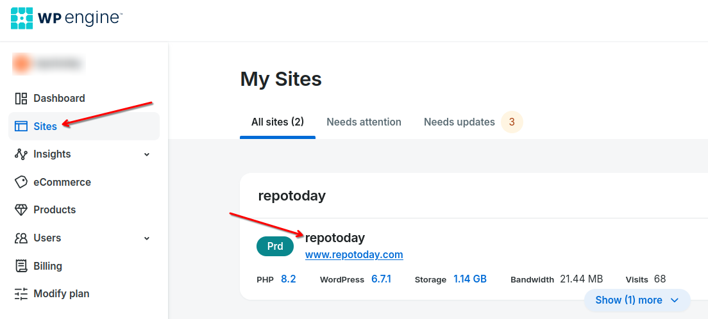
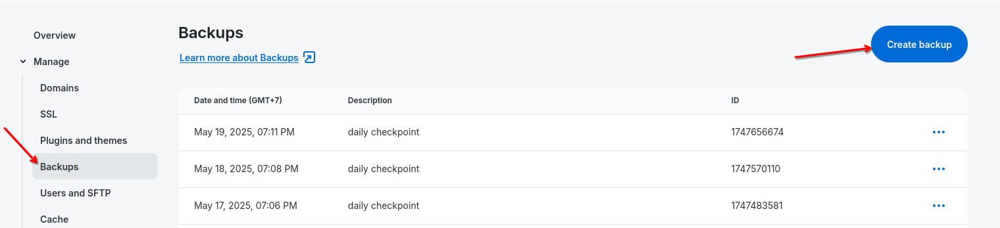
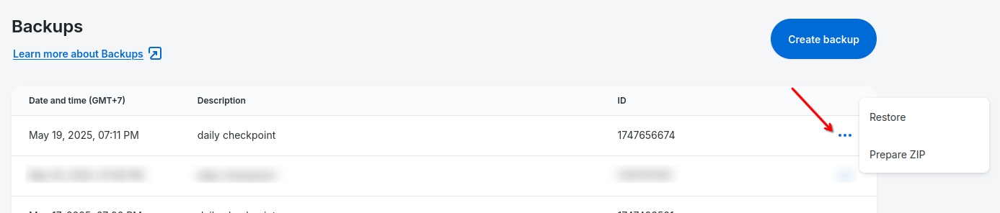

# Workflows
## android
## asp.net
## ios

## wordpress
### ci-wordpress reusable workflow

### Deploying

In order to deploy, you need to perform some steps:

- Create a new workflow file for deploying your app, for example, [`deploy.yml`](https://github.com/saritasa-nest/ceai-wordpress/blob/develop/.github/workflows/ci-prod.yml)
- Place the created playbook in your repository for example, [`ci\ansible\deploy.yaml`](https://github.com/saritasa-nest/ceai-wordpress/blob/develop/ci/ansible/ansistrano-rollback.yml)
- Set up variables for workflow (see [Inputs Variables](#inputs-variables))
- Create a workflow, configure workflow start triggers (see examles)

Watch the [ru video](https://vimeo.com/manage/videos/869032249)
Watch the [en video](https://vimeo.com/manage/videos/871687786)

During deployment, ansistrano looks at the current timestamp in runner by executing `date -u +%Y%m%d%H%M%SZ`. Each new release is placed in a folder with a name consisting of the previously received timestamp.

If everything has been set up properly, after completing the workflow approximately the following structure will be created on the server.
Check how the on your server folder structure would look like after one, two and three deployments.

```
-- /var/www/my-app.com
|-- current -> /var/www/my-app.com/releases/20100509145325
|-- releases
|   |-- 20100509145325
|-- shared
```

```
-- /var/www/my-app.com
|-- current -> /var/www/my-app.com/releases/20100509150741
|-- releases
|   |-- 20100509150741
|   |-- 20100509145325
|-- shared
```

```
-- /var/www/my-app.com
|-- current -> /var/www/my-app.com/releases/20100512131539
|-- releases
|   |-- 20100512131539
|   |-- 20100509150741
|   |-- 20100509145325
|-- shared
```

current - The symlink folder that point out to latest release's timestamp that exist in release folder
releases - The folder where the releases are saved. This folder will have a few folders depend on how many release we want to keep before the clean up process occured
shared - This folder contains shareable files that we can re-used between release. This files should **not get into the repository**, but are necessary for the work of the Wordpress

### Rolling back

In order to rollback, you need to set up the deployment and run the rollback workflow. Workflow, will switch the current folder to the previous release.
- Create a new workflow file for rollback, for example, [`rollback.yml`](https://github.com/saritasa-nest/ceai-wordpress/blob/develop/.github/workflows/ci-rollback.yml)
- Place the created playbook in your repository for example, [`ci\ansible\rollback.yaml`](https://github.com/saritasa-nest/ceai-wordpress/blob/develop/ci/ansible/ansistrano-deploy.yml)

Watch the [ru video](https://vimeo.com/manage/videos/869032751)
Watch the [en video](https://vimeo.com/manage/videos/871687786)

Before rollback
```
-- /var/www/my-app.com
|-- current -> /var/www/my-app.com/releases/20100512131539
|-- releases
|   |-- 20100512131539
|   |-- 20100509150741
|   |-- 20100509145325
|-- shared
```

After rollback
```
-- /var/www/my-app.com
|-- current -> /var/www/my-app.com/releases/20100509150741
|-- releases
|   |-- 20100509150741
|   |-- 20100509145325
|-- shared
```

### Inputs variables

| Variable       | Type          | Example                  | Discription                                                                                                       |
| ---------------|:-------------:| :------------------------|-------------------------------------------------------------------------------------------------------------------|
| host           | string        | 59.128.16.24             | The address of the server for deploy                                                                              |
| username       | string        | user                     | The linux OS username for connect to server via ssh                                                               |
| environment    | string        | production               | The environment for deploy i.e development, staging, production                                                   |
| playbook_path  | string        | ci/ansible/playbook.yaml | The path to the file relative to the repository from which the deployment is made, used in Ansistrano deploy task |
| deploy_path    | string        | ~/deploy                 | The path to deploy on the remote server                                                                           |
| deploy_repo    | string        | git@github.com:saritasa-nest/ceai-wordpress.git | The path to deploy on the remote server                                                    |
| deploy_branch  | string        | develop                  | The branch from which the deployment is made                                                                      |
| python_version | number        | 3.11.4 | Each python version supports a certain range of ansible versions, so we need to specify the current version of python in order to install the latest version of ansible. |
| runner         | string        | saritasa-rocks-eks       | The runner on which workflow is running: ubuntu, macos, windows, etc                                              |

### Inputs secrets

| Variable        | Discription                                                    |
| ----------------|:---------------------------------------------------------------|
| ssh_private_key | The private key for connect to server via ssh                  |

### Examples

#### Workflow for deploy

Watch the [ru video](https://vimeo.com/manage/videos/869032249)
Watch the [en video](https://vimeo.com/manage/videos/871687786)

This implementation is used in the [CEAI-Wordpress project](https://github.com/saritasa-nest/ceai-wordpress/tree/main/.github/workflows) project to deploy Wordpress on shared hosting.

`ci-prod.yml`

```bash
name: Deploy to Bluehost
on:
  workflow_dispatch:

jobs:
  deploy:
    uses: saritasa-nest/saritasa-github-actions/.github/workflows/ci-wordpress.yaml@v2.4
    with:
      ENVIRONMENT: production                                      # The Environment for deploy
      HOST: 50.87.253.20                                           # The server for deploy
      USER: ${{ vars.SSH_DEPLOY_USER }}                            # The username for connect to server via ssh
      PLAYBOOK_PATH: ci/ansible/ansistrano-deploy.yml              # The path to the file relative to the repository from which the deployment is made
      DEPLOY_PATH: ~/deploy/                                       # The path to deploy on the server
      DEPLOY_REPO: git@github.com:saritasa-nest/ceai-wordpress.git # The repository for deploy
      DEPLOY_BRANCH: develop                                       # The branch for deploy
      PYTHON_VERSION: 3.11                                         # The version of python
      RUNNER: saritasa-rocks-eks                                   # The type of github runner

    secrets:
      ssh_private_key: ${{ secrets.SSH_PRIVATE_KEY }}

```

### Ansistrano deploy playbook

`ansistrano-deploy.yml`

```bash
---
- name: deployment
  hosts: all
  vars:
    ansistrano_keep_releases: 10
    ansistrano_deploy_from: "{{ playbook_dir }}/../.."
    ansistrano_deploy_to: "{{ deploy_path }}"
    ansistrano_git_repo: "{{ deploy_repo }}"
    ansistrano_git_branch: "{{ deploy_branch }}"
    ansistrano_deploy_via: "rsync"
    ansistrano_rsync_set_remote_user: yes
    ansistrano_git_depth: 1
    ansistrano_shared_paths:
      - wp-content/uploads
    ansistrano_shared_files:
      - wp-config.php
      - .htaccess
  roles:
      - { role: ansistrano.deploy }
```
`ansistrano_keep_releases` number of stored releases default 3

`ansistrano_deploy_from` where my local project is (relative or absolute path)

`ansistrano_deploy_to` base path to deploy to

`ansistrano_git_repo` location of the git repository

`ansistrano_git_branch` what version of the repository to check out. This can be the full 40-character SHA-1 hash, the literal string HEAD, a branch name, or a tag name

`ansistrano_deploy_via` deployment strategy - method used to deliver code. Options are copy, download, git, rsync, rsync_direct, svn, or s3.

`ansistrano_rsync_set_remote_user` allows the use of the module synchronize of ansible. See official [docs](https://docs.ansible.com/ansible/latest/collections/ansible/posix/synchronize_module.html)

`ansistrano_git_depth` additional history truncated to the specified number or revisions

`ansistrano_shared_paths` shared folders, usually folders with images or other bulk data

`ansistrano_shared_files` files that should not get into the repository are not necessary for the work of Wordpress

#### Workflow for rollback for one step back

Watch the [ru video](https://vimeo.com/manage/videos/869032751)
Watch the [en video](https://vimeo.com/manage/videos/871687786)

`ci-rollback.yml`

```bash
name: Rollback to Previously release
on:
  workflow_dispatch:

jobs:
  deploy:
    uses: saritasa-nest/saritasa-github-actions/.github/workflows/ci-wordpress.yaml@v2.4
    with:
      ENVIRONMENT: production                                      # The Environment for deploy
      HOST: 50.87.253.20                                           # The remote server
      USER: ${{ vars.SSH_DEPLOY_USER }}                            # The username to connect to server via ssh
      PLAYBOOK_PATH: ci/ansible/ansistrano-rollback.yml            # The path to the file relative to the repository from which the deployment is made
      DEPLOY_PATH: ~/deploy/                                       # The path to deploy on the server
      PYTHON_VERSION: 3.11                                         # The version of python
      RUNNER: saritasa-rocks-eks                                   # The type of github runner

    secrets:
      ssh_private_key: ${{ secrets.SSH_PRIVATE_KEY }}
```

### Ansistrano rollback playbook

`ansistrano-rollback.yml`

```bash
---
- name: rollback
  hosts: all
  vars:
    ansistrano_deploy_to: "{{ deploy_path }}"
  roles:
      - { role: ansistrano.rollback }
```

More information for adnsistrano playbook in official [docs](https://github.com/ansistrano/deploy/blob/master/README.md)

### Synchronization of client changes

In the process of working with the website, the client can install, change settings and add modules using the Wordpress web interface.
In order for these changes to appear in the repository, it is necessary to commit from the `current` folder, i.e. perform the following actions (for the example described above):

```bash
cd ~/deploy/current
```

```bash
git add . && \
git commit -m 'Commit message' && \
git push
```

## WPEngine reusable workflow

### `wpengine-deploy.yaml`

This reusable workflow is used for deploying code from the GitHub repository to the WordPress server via WPEngine. 
Workflow creates a backup of the environment, deploys code, and sends a notification to the Slack channel about the result of the deploy.

### Inputs

| Name              | Description                                                                         | Required | Default       |
| ----------------- | ----------------------------------------------------------------------------------- | -------- | ------------- |
| `backup_emails`   | Notification emails list to send confirmation about the backup, separated by commas | Yes      | -             |
| `backup_interval` | Interval for backup status check (in seconds)                                       | No       | 30            |
| `backup_timeout`  | Wait time for backup to complete (in minutes)                                       | No       | 5             |
| `exclude_flags`   | Additional rsync exclude flags (can be multiple)                                    | No       | --exclude=.*  |
| `jira_key`        | JIRA key of the project                                                             | Yes      | -             |
| `wp_engine_env`   | Name of the WPEngine environment, i.e. repotodaystdev                               | Yes      | -             |

### Secrets

| Name                    | Description                                        | Required |
| ----------------------- | -------------------------------------------------- | -------- |
| `slack_webhook_url`     | Slack webhook url to send notifications to channel | Yes      |
| `wpengine_api_username` | Username for API access to WPEngine                | Yes      |
| `wpengine_api_password` | Password for API access to WPEngine                | Yes      |
| `wpengine_ssh_key`      | Private SSH key needed to connect to server        | Yes      |

## `backup` job

This job creates a full backup of the selected environment via calls to the WPEngine API

### How to access backups

Backups are managed and stored by WPEngine. They are available in the WPEngine User Portal.
Link to credentials used to login to WPEngine as `devops+arssu@saritasa.com`: https://keys.saritasa.cloud/cred/detail/3kuDwp3e7EXBCjtZW37Tsn/

1. Go to the [Sites](https://my.wpengine.com/sites) page
   
2. Select environment (e.g., `repotoday`)
3. Go to **Backups** section
4. Find the needed backup (by date, description or ID)
5. Prepare ZIP for download or restore backup

### How to create backup (clickops way)

`backup` job uses API calls to create backups, but if needed one can create a backup manually

1. In **Backups** select **Create backup**
   
2. Select backup destination and notification emails
3. Confirm the create
4. To see details about backup creation, click **View details** on a status banner

WPEngine's backup process creates a complete snapshot of the environment, including:

- database
- files
- plugins and their configurations

### How to restore backup

1. In **Backups** select the backup you want to restore
   
2. Click **Restore**
3. Select an environment name to restore this backup to
4. Confirm the restore

**Note: This will overwrite all content of the selected environment to match the content of the selected backup**

For more info on backups, see [official documentation on Backup and Restore](https://wpengine.com/support/restore)

## `deploy` job

This job uses official WPEngine action to deploy code from GitHub to the selected environment

### How it works

1. Job uses `actions/checkout` to clone the repository
2. Then it uses `wpengine/github-action-wpe-site-deploy` to deploy code with `rsync`:
   - rsync flags:
     - `-a` - enable recursion and preserves almost everything (file permissions, symbolic links, timestamps)
     - `-z` - compress file data
     - `-v` - verbose
     - `-r` - recursive
     - `--inplace` - update files "inplace" without creating temporary copies
     - `--delete` - delete files in the dst that no longer exist in the src
     - `--exclude=.*` - exclude dotfiles and dotfolders
     - additional `--exclude` flags can be passed with the `exclude_flags` input (default `--exclude=.*`)

For more info on how this action works, see [WPEngine GitHub Action page](https://github.com/wpengine/github-action-wpe-site-deploy)

## `send-notifications` job

This job sends a Slack notification (successful or failed) about the result of the `deploy` job

### How it works

1. Job runs a `prepare` step to collect info for the notification message
2. Then it uses `slackapi/slack-github-action` to send the message (based on `deploy_result`) to the Slack channel

For more info on how this action works, see [Slack Send GitHub Action page](https://github.com/slackapi/slack-github-action)
