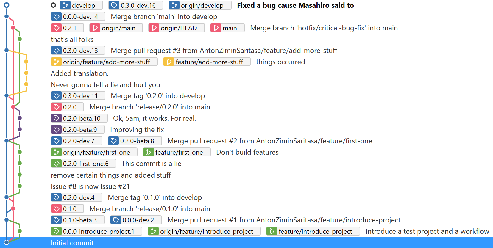

# generate-version

Generates SemVer by Git branch or tag. Updates version in .NET project files.

A unique release name is guaranteed for every branch+changeset combination.



## Inputs

- main-branch-name
- update-dotnet-project-files
- dotnet-projects

## Outputs

- informational-version
- semver
- assembly-semver

## Examples

[Sample Workflow](https://github.com/AntonZiminSaritasa/generate-version-demo/blob/main/.github/workflows/windows-build.yml)

```
    - name: Get version from Git and update .NET projects
      id: gitversion
      uses: Saritasa/github-actions/generate-version@0.1.0
      with:
        update-dotnet-project-files: true
```

```
    - name: Get version from Git and update .NET projects
      id: gitversion
      uses: Saritasa/github-actions/generate-version@0.1.0
      with:
        main-branch-name: main
        update-dotnet-project-files: true
        dotnet-projects: '**/*.csproj'
```

## Recommended Configuration

### Push

```
on:
  push:
    branches:
      - develop
      - release/*
    tags: [ '*' ]
```

- Build develop branch (-dev suffix).
- Build release branch (-beta suffix).
- Build every tag (it should belong to the main branch).
- Do not build the main branch directly.

You can also build feature/ and hotfix/ branches. They will use the branch name as a suffix. Example:

```
/feature/my-test-feature

0.1.0-my-test-feature.20
```

### Checkout

```
    steps:
    - uses: actions/checkout@v2
      with:
        fetch-depth: 0
```

The checkout step is mandatory. We need to fetch all tags and remote branches.

## Warnings

> Branch main does not have a tag.

The HEAD of the main branch should always have a SemVer tag. Assign the tag manually after the merge of a release or a hotfix branch.

Possibly the `checkout` step is missing or `fetch-depth` is not `0`.

## Error Messages

> Error: Tag 123.1.1 does not belong to main branch.

All SemVer tags should belong to the main branch.

> Error: Found a tag refs/tags/123.1.0-dev.28 in the wrong format. Expected SemVer: x.x.x

Only SemVer tags are supported. Ignore tags in the workflow if you need them.

